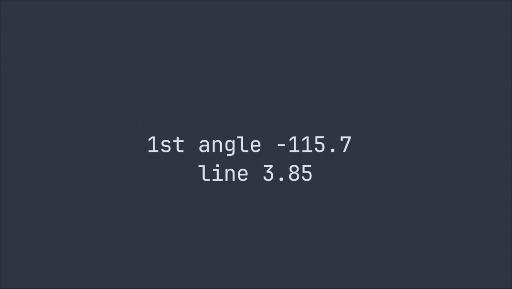
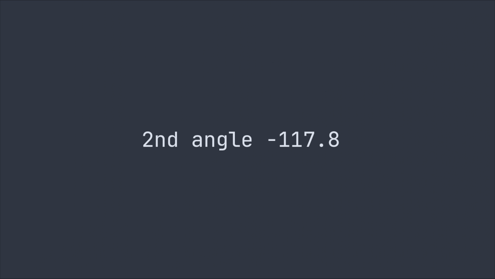
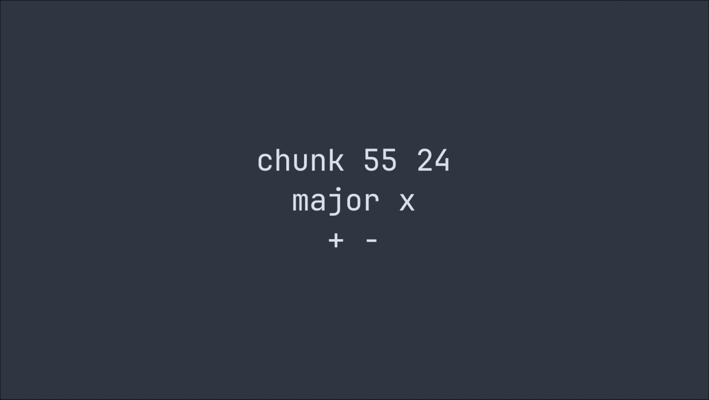
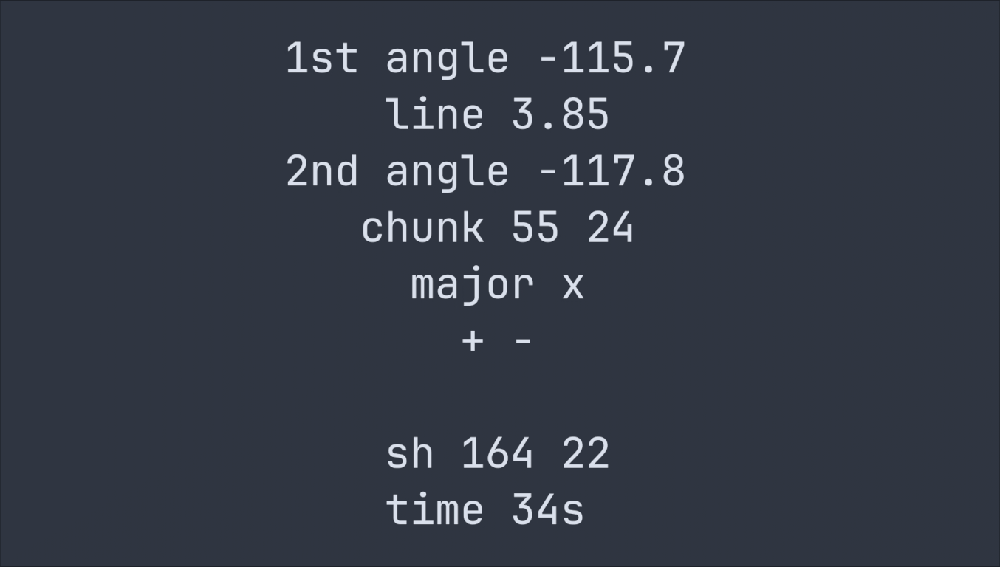

# (P)ractice Axis (M)ath

Small tool to generate a random stronghold coords and blind coords then show the
axis angles. To use this program, compile and run. To show new information, the
old information is hidden to mimic real runs.

## Usage

1. After running the program, the first angle measurement and corresponding
   chunk line is shown
2. Press any key to show the 2nd angle measurement
3. Again press any key to show the chunk coordinates, major direction and
   whether its neg x pos x or whatever
4. Finally press any key to show all the previous information and the stronghold
   coords in the nether. Since one chunk, no f3+c axis isn't very accurate it is
   expected that the calculated will differ however you should be pretty close
5. After the check screen you can press esc or q to quit or press any key to
   restart with a new stronghold

You can set the environment variables F3 and sheetless to switch to 2 dp of
precision like with F3+C and to travel 28 blocks instead of 16 to do [sheetless](https://www.youtube.com/watch?v=OKJxB9ClPbo)
instead.

## Example

abs(115.7) is within angle range 45-135 meaning the major is x\
since angle is negative the major is positive x\
abs(115.7) is above 90 meaning the minor is negative z

this information is given on a later page so it isn't necessary to derive
however since the angle should be memorised anyways it can free up some
memory/save time on measuring

(-115.7) - (-117.8) = angle change of 2.1

nether coords are double chunk coords -> 110 48\
angle change 2.1 would mean 55 on major (+x) and line 3.75 (approximate to nearest quarter) would mean 26 on the minor (-z)

x: (110) + (55) = 165 \
z: (48) + (-26) = 22

since the angle change was relatively big the result was fairly accurate, on average you can expect angles more around 0.6 which could be off by tens or at worst a hundred blocks
